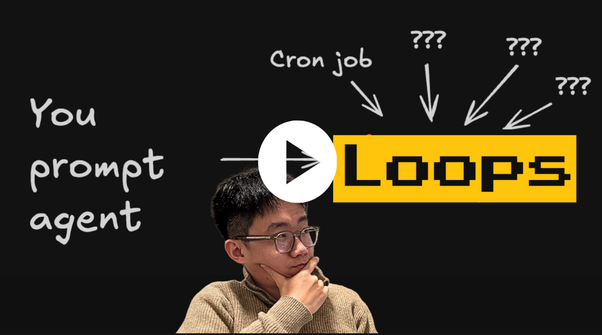
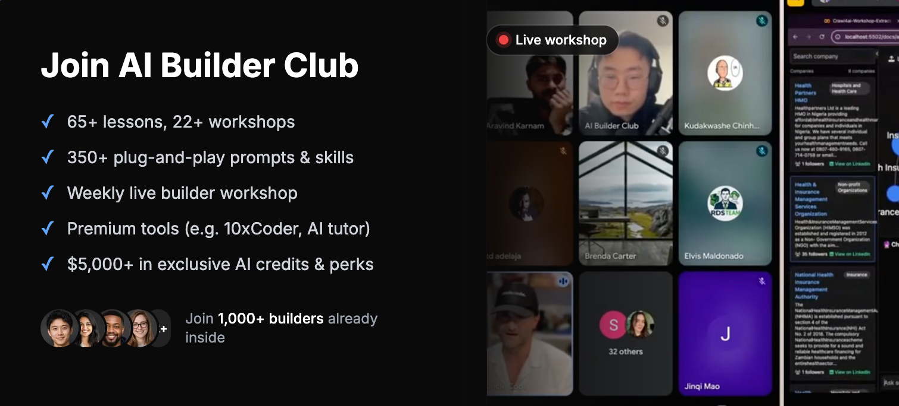

[](https://www.aibuilderclub.com/lp/loop-engineer?utm_source=github&utm_campaign=aibc-skills)

# AI Builder Club — Skills

A Claude Code **plugin marketplace** of the skills we share at
[AI Builder Club](https://www.aibuilderclub.com/lp/loop-engineer?utm_source=github&utm_campaign=aibc-skills)
for building **loop engineers**: agents that get triggered on their own, pick up work, ship it,
verify it, and log what they learned, so the work compounds without you prompting every step.
It's the productized version of the setup my team runs in production.

Two flagship skill sets (more to come):

- **Codebase harness** — make any repo agent-ready (run, test, verify, ship — including an
  isolated cloud box per agent so loops ship code in *parallel*).
- **Loops** — spin up compounding agent loops on a shared, file-based knowledge base.

## Loop engineer & Codebase harness

The shift: you stop prompting a coding agent task-by-task, and start **designing loops**.

A loop is an agent that wakes up on a trigger (a cron, a webhook, an incident, another agent),
does some investigation and work, and writes what it found and did into a shared, file-based
memory. Next run it reads that memory and keeps going. The real power is **compounding**: many
loops (support, SEO, product, ads) read and write the *same* folders, so a friction the support
loop logs can get picked up by the product loop, and a keyword the ads loop finds can feed the
SEO loop. One shared brain, many loops.

Building one comes down to four ingredients:

1. **Triggers:** cron, webhook, an incident, or another agent wakes the loop at the right time.
2. **A file + logging structure:** the shared memory loops read and write → the **`loops`** skills.
3. **Tools & connectors:** so the agent can do real work (your skills/MCPs).
4. **A codebase harness:** so the agent can run, test, and verify its own work → the
   **`codebase-harness`** skills.

This single **`skills`** plugin ships both sets — giving you **#2 and #4**, plus the
scaffolding to add the rest.

Want the full walkthrough of the concept and how my team designs compounding loops? Watch the video:

[](https://youtu.be/W6x-hb44C0c)

## Install

```text
/plugin marketplace add AI-Builder-Club/skills
/plugin install skills@ai-builder-club
```
One plugin, all the skills below.

## The two entry points

### `/setup-codebase-harness` — make a code repo agent-ready
Run it in the code repo your agents work in, so they can run, test, and verify their own work.
It orchestrates the harness skills below — pull in only what the repo needs.

### `/new-loop` — build your shared brain
Run it where your agent's memory should live. First run **bootstraps the knowledge base**
(creates `ARCHITECTURE.md`, `LOG.md`, the `signals/ docs/ domains/` folders, and a knowledge-base
section in your `CLAUDE.md`); then it scaffolds the loop, does one real test run, and logs it.
Run it again any time to add another loop.

## The skills (when to use which)

**Codebase harness** — make a repo agent-ready

| Skill | Use it when… |
|---|---|
| **`setup-codebase-harness`** | Onboarding a repo to agent-driven dev — the master that orchestrates the four below. |
| **`dev-local-setup`** | You need a one-command local dev stack (`scripts/dev-local.sh up`). |
| **`e2e-setup`** | The repo has no (or weak) e2e — add a real per-PR test gate. |
| **`crabbox-setup`** | Loops ship code **in parallel** — give each agent its own isolated **cloud** stack (one laptop can't run N). The cloud counterpart to dev-local. |
| **`pr`** | A change is ready — a fresh sub-agent proves the feature works, then opens the PR with proof. |

**Loops** — the shared knowledge base

| Skill | Use it when… |
|---|---|
| **`new-loop`** | You want a new loop/workstream the agent owns (bootstraps the knowledge base on first run). |

After setup, each session the agent reads `CLAUDE.md` + the relevant domain README, does work,
writes artifacts, and appends to `LOG.md`. For code changes it drives `ship-change` and ships via `/pr`.

## Requirements

- [Claude Code](https://claude.com/claude-code) (the skills assume it).
- `git`. That's the only hard dependency for the knowledge base + harness.
- The harness skills want the code repo they ship into to be a git repo with a working build/test
  setup. They use Codex for review if available, and degrade gracefully if not.
- `crabbox-setup` (optional, for parallel cloud boxes) needs the `crabbox` CLI + a provider
  (Daytona: `daytona` CLI / `DAYTONA_API_KEY`).

## Repo layout

```
skills/                                a Claude Code plugin (also a marketplace)
├── .claude-plugin/
│   ├── marketplace.json              marketplace: ai-builder-club
│   └── plugin.json                   plugin: skills   (source ".")
└── skills/                           top-level skills
    ├── new-loop/                     (loops) — + references/: ARCHITECTURE · LOG · KNOWLEDGE_SETUP · CLAUDE.template
    ├── setup-codebase-harness/       (harness) — orchestrator
    ├── dev-local-setup/              (harness)
    ├── e2e-setup/                    (harness)
    ├── crabbox-setup/                (harness) — isolated cloud box per agent
    └── pr/                           (harness) — verify-before-ship  (+ ship-change.js)
```

## Go deeper

These skills get you the structure. If you want to learn how to actually build agents and run
compounding loops for your own business, that's what I go deep on inside
**[AI Builder Club](https://www.aibuilderclub.com/lp/loop-engineer?utm_source=github&utm_campaign=aibc-skills)**:
weekly live builder workshops, courses on production AI agents, AI coding beyond the basics, and
building your first LLM apps, plus a community of people building the same way.

[](https://www.aibuilderclub.com/lp/loop-engineer?utm_source=github&utm_campaign=aibc-skills)

**→ [Join AI Builder Club](https://www.aibuilderclub.com/lp/loop-engineer?utm_source=github&utm_campaign=aibc-skills)**

Built by [Jason Zhou](https://x.com/jasonzhou1993) (AI Jason).
